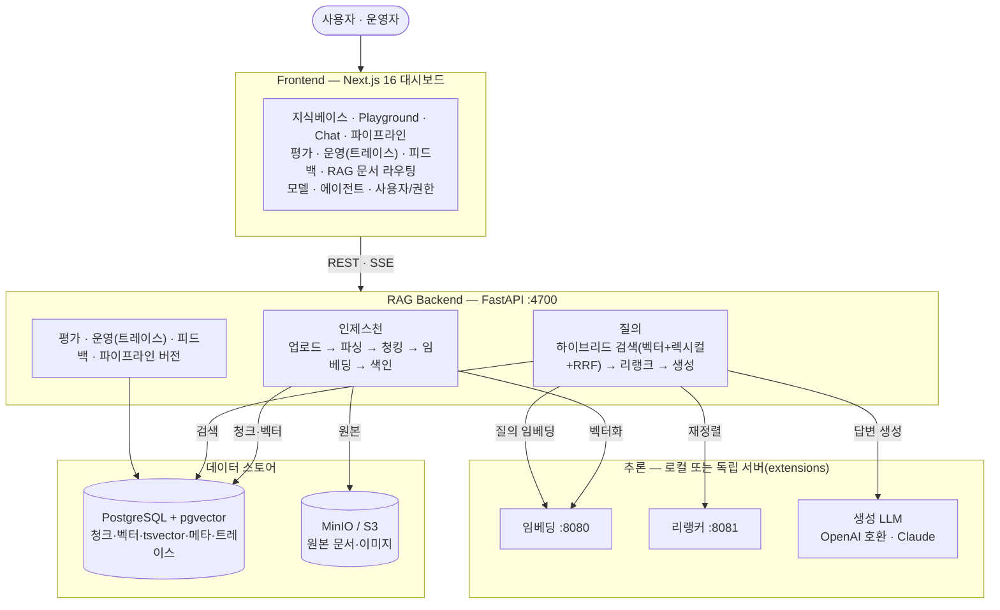
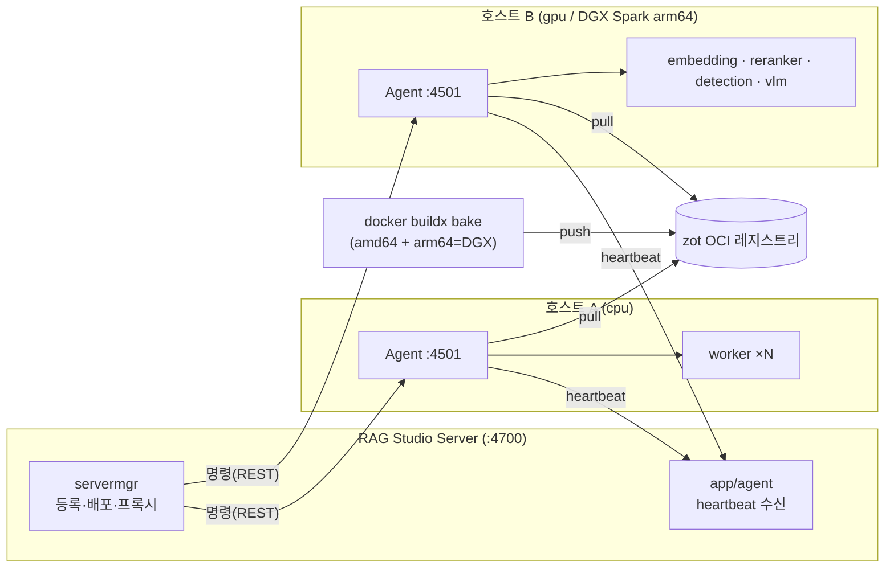

# Argus RAG Studio

[](LICENSE)
[](backend/pyproject.toml)
[](frontend/package.json)

RAG(Retrieval-Augmented Generation) 파이프라인의 **구축 · 검색/생성 · 평가 · 운영 · 배포**를
한 곳에서 다루는 플랫폼. "한 번 동작하는 RAG 앱"이 아니라 **측정 → 최적화 → 개선 루프**와
**원격 배포·운영**까지 갖춘 RAG 스튜디오를 지향한다.

- 사용자·개발자 매뉴얼(Antora): [`docs/`](docs/)
- 서비스별 배포 가이드(Docker/systemd/shell): [`deploy/README.md`](deploy/README.md)
- 버전 관리 규약(락스텝·릴리스 절차·검사 스크립트): [`VERSIONING.md`](VERSIONING.md)

---

## 아키텍처

### 데이터 평면 — 색인 & 질의



### 배포·운영 평면 — 에이전트로 원격 배포

각 호스트의 **Argus RAG Studio Agent(:4501)** 가 RAG Studio의 명령을 받아 Worker·임베딩/리랭커/검출·HWP·VLM(vLLM)
서버를 **Docker 또는 systemd**(워커 권장)로 배포·관리한다. 이미지는 `zot` OCI 레지스트리에서 받는다.
수동(MANUAL) 배포·K8s 배포도 하트비트/프로브로 **서비스 관리** 화면에 통합 표시된다.



> 이미지 변형은 호스트 arch로 자동 선택: amd64 GPU=`gpu`(onnx), arm64/Blackwell GPU=`gpu-torch`(torch).
> 배포 완료 시 `embedding.server_url` 등 RAG 설정이 자동 주입된다.

---

## 기술 스택

- **Backend**: Python 3.11+ / FastAPI(async) / SQLAlchemy 2.0 / PostgreSQL + pgvector / Pydantic v2
- **Frontend**: Next.js 16(App Router) / React 19 / TypeScript / Tailwind 4 + shadcn/ui / pnpm + Turbo
- **추론 서버**: FastEmbed(ONNX) 또는 torch(cu128, GPU/Blackwell) — `extensions/`
- **배포**: Argus RAG Studio Agent(FastAPI) · Docker/Podman · zot 레지스트리 · `docker buildx bake`
- **인증**: 로컬 JWT(HS256) + Keycloak OIDC + API 키(서비스 계정)

## 핵심 기능

| 축 | 내용 |
|----|------|
| **Build** | 멀티포맷 인제스천(txt/pdf/docx/xlsx/pptx/hwp/hwpx/…), 파싱전략(`text`·`layout`·`docai`·`vlm`·`rhwp`), 청킹 8종, 컬렉션별 임베딩·차원·거리메트릭, **RAG 문서 라우팅**(경로·메타 규칙 + 내용 임베딩 유사도 → 컬렉션 자동 배정) + **소스 워치**(드롭존 주기 스캔·무인 수집) |
| **Retrieve & Generate** | 하이브리드 검색(벡터+렉시컬+RRF), 리랭킹(none/llm/cross_encoder), 인용 답변, 멀티턴 챗(SSE), 페더레이션 검색/질의 |
| **Evaluate** | 골든 데이터셋, Hit Rate·MRR, LLM-as-judge(faithfulness/answer_relevance/correctness), 피드백 👍/👎 → 골든셋 승격 |
| **Operate** | 파이프라인 버전·롤백·diff·비교, 질의 트레이스·p50/p95 통계·토큰, API 키, 워커 분리 배포·하트비트 모니터링, **서비스 관리**(관리형+수동+워커 통합 현황: 배포 유형·모델·디바이스·자원 사용률·재시작) |
| **Deploy** | **에이전트 기반 원격 배포**(servermgr → Agent: Docker/systemd), 이미지 파이프라인(`docker-bake.hcl`+zot), **GPU 변형 자동 선택**, 배포 시 설정 자동 주입, **모델 레지스트리 + 에어갭 모델 반입**(팩→Model Repository→배포 시 자동 설치·오프라인 서빙) |
| **Annotation** | 이미지 OCR 라벨링(bbox+텍스트, AI-Hub JSON 입출력), 이미지 탐색기, 이미지 추출·분석 |

각 기능의 사용법과 화면 흐름은 [`docs/`](docs/) 매뉴얼을, 변경 이력은
[`CHANGELOG.md`](CHANGELOG.md) 를 참조.

---

## Extensions — 독립 서버·도구 및 사용 모델

`extensions/` 의 각 구성요소는 RAG 백엔드와 분리된 독립 배포물이며, 에이전트가 Docker로 배포한다
(zot 제외). 임베딩/리랭커 모델은 **기본값이며 설정으로 교체 가능**하다.

| 구성요소 | kind | 기본 모델 / 엔진 | 백엔드 | 포트 | GPU 변형 |
|----------|------|------------------|--------|:----:|----------|
| [embedding_server](extensions/embedding_server/) | `embedding` | `mixedbread-ai/mxbai-embed-large-v1` (1024d) | FastEmbed(ONNX) / torch | 8080 | cpu·gpu·gpu-torch |
| [reranker_server](extensions/reranker_server/) | `reranker` | `Xenova/ms-marco-MiniLM-L-6-v2` | FastEmbed(ONNX) / torch | 8081 | cpu·gpu·gpu-torch |
| [detection_server](extensions/detection_server/) | `detection` | PaddleOCR(`korean`) / EasyOCR(`ko,en`) | paddleocr(CPU) / easyocr(torch) | 8082 | cpu·gpu |
| [hwp_render_server](extensions/hwp_render_server/) | `hwp_render` | — (Chromium 렌더, ML 모델 없음) | Node + `@rhwp/core` | 8085 | 단일 |
| [retrieval-fine-tuning](extensions/retrieval-fine-tuning/) | (finetune) | base `intfloat/multilingual-e5-large` | sentence-transformers(torch) | — | 일회성 배치 |
| [zot-registry](extensions/zot-registry/) | — | — (OCI 레지스트리) | zot | 5000 | — |
| [nifi-cluster-deploy](extensions/nifi-cluster-deploy/) | — | — (Ansible 설치형) | Ansible | — | — |

> 임베딩 서버는 OpenAI 호환이라 요청 `model` 로 임의 HF 모델을 가리킬 수 있다(차원은 `EMBED_DIM` 으로 고정).
> RAG 백엔드 기본 임베딩 모델은 `bge-m3`(1024d)이며 컬렉션별로 다르게 지정 가능. 모델은 이미지에 동봉하지 않는다 —
> **관리 > 모델 관리**(모델 레지스트리)에 등록하고 Model Repository(`argus-models` 버킷)에 팩을 반입하면
> 배포 시 대상 서버 볼륨에 자동 설치되어 **오프라인 서빙**된다(에어갭). 온라인 환경은 HF 런타임 다운로드로 폴백.
> vLLM(VLM, `vlm` kind)도 같은 방식으로 배포·모델 관리한다.

---

## 빠른 시작

```bash
# 1) 인프라 (PostgreSQL+pgvector, MinIO)
docker compose -f deploy/docker-compose.infra.yml up -d

# 2) 백엔드 (포트 4700)
cd backend && make dev && make run

# 3) 프론트엔드 (포트 3000)
cd frontend && pnpm install && pnpm dev
```
기본 로컬 계정: `admin` / `admin` (최초 로그인 시 비밀번호 변경).

### 추론 서버 (선택)
임베딩·리랭킹은 백엔드 내 **로컬(FastEmbed)** 로도 동작하므로 필수는 아니다. 분리·확장하려면:
```bash
cd extensions/embedding_server && docker compose up -d --build   # :8080 OpenAI 호환 /v1/embeddings
cd extensions/reranker_server  && docker compose up -d --build   # :8081 /rerank
# GPU(torch, aarch64/Blackwell): docker compose -f docker-compose.gpu-torch.yml up -d --build
```
지식베이스 생성 시 임베딩 프로바이더=`OpenAI 호환`(URL `http://<host>:8080/v1`), 리랭커=`cross_encoder`.

### 운영 환경 보안 설정 ⚠️

위 빠른 시작은 **로컬 개발용 기본값**으로 동작한다. 편하지만 그대로 운영에 올리면 위험하다.
운영 배포 전 아래 항목을 반드시 설정·교체할 것. (전체 정책: [SECURITY.md](SECURITY.md))

| 항목 | 환경변수 / 위치 | 조치 |
|------|-----------------|------|
| 로컬 JWT 서명키 | `ARGUS_JWT_SECRET` | 충분히 긴 무작위 값. 미설정 시 개발용 기본키가 쓰이며 경고 로그가 남는다 |
| 오브젝트 스토리지 자격증명 | `ARGUS_OS_ACCESS_KEY` / `ARGUS_OS_SECRET_KEY` | 기본값(`minioadmin`) 교체 |
| DB 자격증명 | `deploy/docker-compose.infra.yml` · `backend/packaging/config/config.yml` | 기본 계정·비밀번호 교체 |
| 최초 관리자 계정 | `admin` / `admin` | 최초 로그인 시 비밀번호 변경(강제) |
| Keycloak OIDC · API 키 | 설정 파일 / 관리 화면 | 운영 IdP 로 교체, 서비스 계정 키 주기적 회전 |
| 에이전트 노출 범위 | Agent(:4501) | 호스트에서 컨테이너·systemd 서비스를 기동할 수 있는 권한 있는 구성요소 — 신뢰 네트워크로 제한 |

### 이미지 빌드/배포 (에이전트 경유)
```bash
make images                                   # 로컬(현재 아키)
make image KIND=embedding VARIANT=gpu-torch    # 단일(DGX/arm64)
VERSION=0.4.2 REGISTRY=zot.airgap.local:5000/argus make images-push   # 멀티아키 push
```
이후 RAG Studio **"에이전트"** 화면에서 호스트 등록 → 서비스/배포로 kind 선택 → 원격 기동.

---

## 디렉터리

```
backend/        FastAPI 서버 (app/{core,auth,collections,documents,ingestion,retrieval,
                generation,evaluation,observability,pipelines,feedback,routing,sourcewatch,
                modelreg,agent,servermgr,deploy,workers,...})
frontend/       Next.js monorepo (apps/web, packages/{ui,eslint-config,typescript-config})
agent/          Argus RAG Studio Agent — 호스트당 1개, servicemgr(systemd)·containermgr(Docker)
extensions/     독립 서버·도구 (embedding/reranker/detection/hwp_render 서버,
                retrieval-fine-tuning, zot-registry, nifi-cluster-deploy)
deploy/         서비스별 배포 가이드(Docker/systemd/shell) · docker-compose(infra=PG+MinIO, backend=API)
docs/           사용자·개발자 매뉴얼 (Antora)
scripts/        build-images.sh (이미지 파이프라인)
docker-bake.hcl · Makefile   이미지 빌드 매트릭스/엔트리
```

---

## 기여 · 라이선스

- **기여** — 버그 리포트·기능 제안·PR 모두 환영합니다. 시작 방법은
  [`CONTRIBUTING.md`](CONTRIBUTING.md) 를 참고하세요.
- **보안** — 취약점은 공개 이슈가 아니라 비공개로 제보해 주세요: [`SECURITY.md`](SECURITY.md)
- **변경 이력** — [`CHANGELOG.md`](CHANGELOG.md)
- **라이선스** — [Apache License 2.0](LICENSE). 저작권·제3자 고지는 [`NOTICE`](NOTICE) 참조.

```
Copyright 2026 Data Dynamics Inc.
Licensed under the Apache License, Version 2.0
```

HWP/HWPX 추출은 [rhwp](https://github.com/edwardkim/rhwp)(MIT)를 사용하며, `vlm` 파싱 전략이
선택적으로 쓰는 PyMuPDF 는 AGPL-3.0 라이선스로 **번들되지 않는다**(직접 설치 시 해당 조건 적용).
자세한 내용은 [`NOTICE`](NOTICE) 를 참고하세요.
