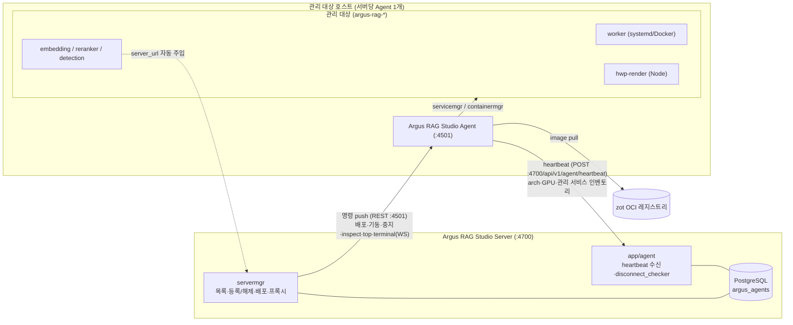
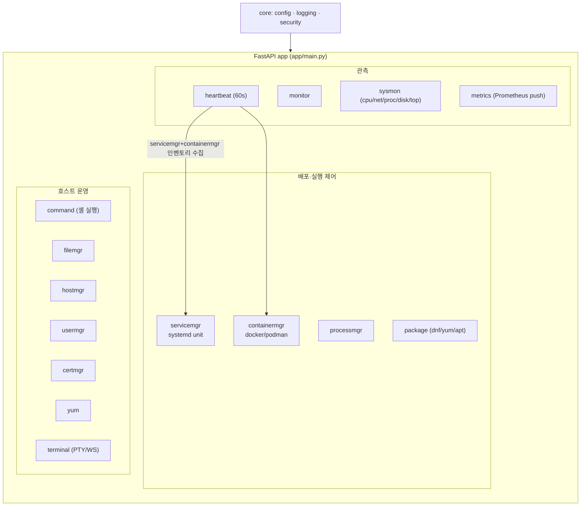
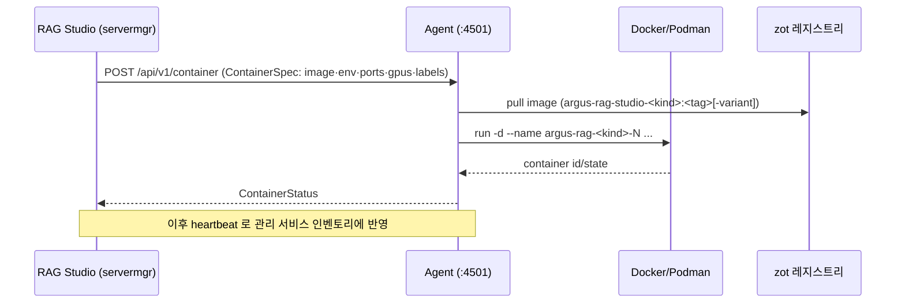

# Argus RAG Studio Agent

관리 대상 서버에 **root 권한**으로 설치되어, Argus RAG Studio가 원격으로 서버를 제어하고
**Worker·임베딩/리랭커/검출·HWP 렌더 서버 등을 배포·기동·관리**하게 하는 서버 관리 에이전트.

- FastAPI(:4501) · systemd 서비스 · root 실행
- RAG Studio Server(:4700)로 60초 주기 **heartbeat**(시스템·GPU·아키텍처·관리 서비스 보고)
- **servicemgr**(systemd) / **containermgr**(Docker·Podman)로 서비스/컨테이너 라이프사이클 관리
- 상세 레퍼런스(전체 API/CLI/설정): [`CLAUDE.md`](./CLAUDE.md)

---

## 아키텍처

### 1) 배포 토폴로지 — RAG Studio ↔ Agent ↔ 관리 대상



### 2) 내부 모듈 구조



### 3) 컨테이너 배포 요청 흐름



---

## 핵심 모듈

| 모듈 | 기능 |
|------|------|
| `command` | 원격 셸 명령 실행(타임아웃·위험명령 차단) |
| `monitor` / `sysmon` | 시스템 리소스(REST/WS), dmesg·CPU·네트워크·프로세스·디스크·top |
| `package` | dnf/yum/apt 패키지 설치/삭제/업데이트 |
| `terminal` | PTY 기반 WebSocket 원격 터미널 |
| `hostmgr` / `usermgr` / `certmgr` | hostname·/etc/hosts·resolv·ulimit / 사용자·SSH키·sudo / CA·호스트 인증서 |
| `filemgr` | 파일·디렉토리 CRUD, chown/chmod, 압축, 프로그램 실행 |
| `processmgr` | 프로세스 목록/시그널/재시작/좀비/open files |
| **`servicemgr`** | **systemd unit 생성/기동/중지/재시작/상태/삭제** (`argus-rag-` 접두사만) |
| **`containermgr`** | **Docker/Podman 컨테이너 pull/run/stop/restart/status/logs/rm** (자동 감지) |
| `heartbeat` | 60초 주기로 RAG Studio Server에 시스템·GPU·arch·관리서비스 보고 |
| `metrics` | 호스트 메트릭 Prometheus Push Gateway 전송 |

배포 대상 컨테이너 이름 규약: `argus-rag-<kind>-<N>` (이미지: `argus-rag-studio-<kind>:<tag>[-variant]`).

---

## 운영 환경

- systemd 서비스(`argus-rag-studio-agent.service`), **root** 실행, 기본 포트 **4501**
- 설정: `/etc/argus-rag-studio-agent/` (`config.yml`·`config.properties`·`server.properties`)
- 로그: `/var/log/argus-rag-studio-agent/` · 데이터: `/var/lib/argus-rag-studio-agent/`
- `server.properties` 의 `server.ip`/`server.port` 를 RAG Studio Server(:4700)로 설정 → heartbeat 송신

## 실행 (개발)

```bash
cd agent
make dev            # pip install -e ".[dev]"
make run            # uvicorn app.main:app --port 4501 --reload
make test           # pytest
make lint           # ruff

# 모듈 실행 / 설정 파일 지정
python -m app.main --config-yaml ./config.yml --config-properties ./config.properties \
  --config-server-properties ./server.properties
```

## API (요약)

| 영역 | 대표 엔드포인트 |
|------|----------------|
| 상태 | `GET /health` |
| 서비스(systemd) | `POST /api/v1/service` · `…/{name}/{start\|stop\|restart}` · `GET/DELETE …/{name}` · `GET /api/v1/service` |
| 컨테이너(Docker) | `POST /api/v1/container` · `…/{name}/{start\|stop\|restart}` · `GET …/{name}/logs` · `GET/DELETE …` |
| 호스트/프로세스/터미널 | `GET /api/v1/host/inspect` · `GET /api/v1/sysmon/top` · `GET /api/v1/process/list` · `POST /api/v1/process/signal` · `WS /api/v1/terminal/ws` |

전체 엔드포인트·CLI(`argus-rag-studio-*`)·설정 항목은 [`CLAUDE.md`](./CLAUDE.md) 참조. Swagger: `http://<host>:4501/docs`.

## 보안

root 실행이므로: `BLOCKED_COMMANDS` 위험명령 차단, `argus-rag-` 접두사 unit/컨테이너만 관리,
argv(exec) 실행으로 인젝션 차단, 보안 헤더, 출력/세션 제한. RAG Studio는 **REGISTERED** 에이전트에만
관리 작업을 허용한다.
