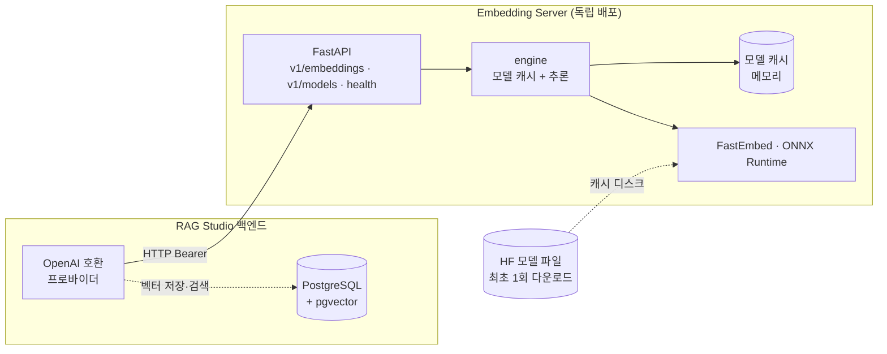
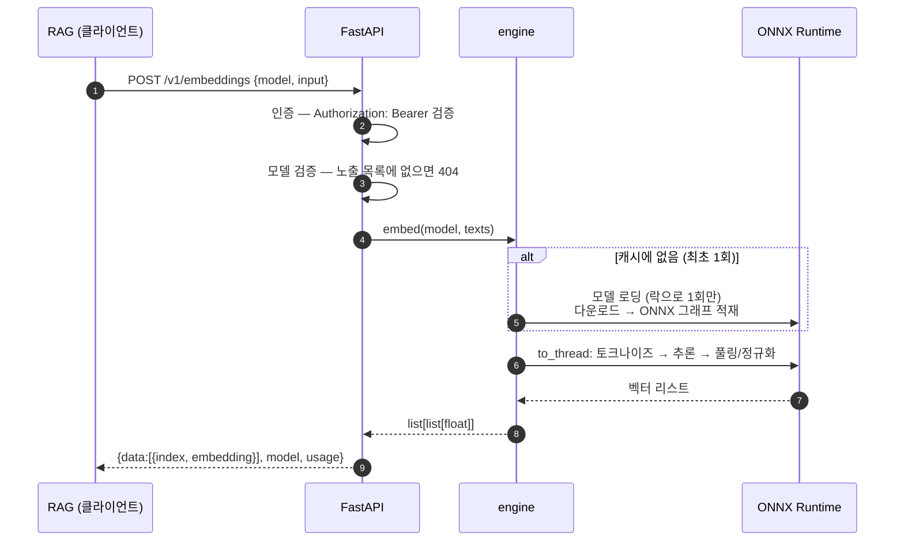
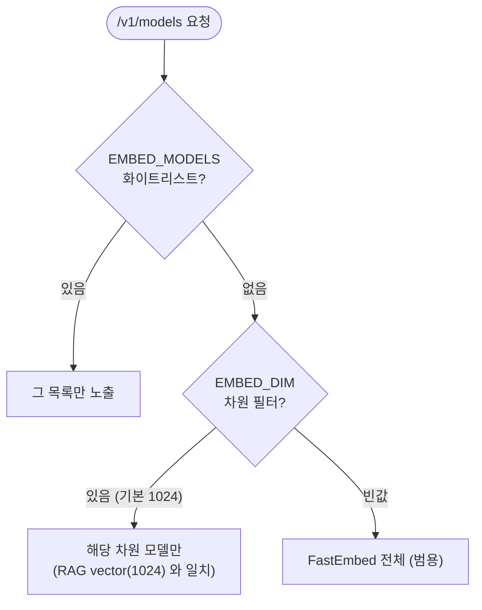

# Argus Embedding Server

FastEmbed(ONNX) 기반 **OpenAI 호환** Embedding Server입니다. RAG Studio 백엔드와 **완전히 독립된
배포물**(별도 프로세스/호스트/컨테이너, DB·RAG 코드 의존 없음)로, RAG Studio 의 "OpenAI 호환"
프로바이더가 그대로 가리킬 수 있어 모델 불러오기·차원 감지·검색이 모두 동작합니다.

```
[RAG Studio 백엔드]  ──HTTP /v1/embeddings──▶  [Embedding Server]  (이 디렉터리)
   app/ + PostgreSQL                              FastEmbed (ONNX, CPU)
```

## 엔드포인트 (OpenAI 호환)

| 메서드 | 경로 | 설명 |
|---|---|---|
| POST | `/v1/embeddings` | `{model, input}` → `{data:[{index,embedding}], model, usage}` |
| GET | `/v1/models` | `{data:[{id,...}]}` — 제공 모델 목록 |
| GET | `/health` | 헬스체크 |

## 동작 원리

전체 구조 — RAG 는 OpenAI 호환 HTTP 클라이언트일 뿐이고, 서버가 FastEmbed(ONNX)로 임베딩을 계산합니다.



### 1) 임베딩이란 — 텍스트를 "의미 벡터"로

임베딩 모델은 문장을 고정 길이의 숫자 배열(예: 1024개 실수 = 1024차원 벡터)로 바꿉니다.
의미가 비슷한 문장은 벡터 공간에서 가깝게 놓이도록 학습돼 있어서, 단어가 달라도("환불"↔"반품")
코사인 유사도로 가까움을 잴 수 있습니다. RAG 는 이 벡터로 "질문과 가장 비슷한 문서 조각"을 찾습니다.

### 2) 한 번의 임베딩 요청이 처리되는 과정

`POST /v1/embeddings` 가 들어오면:



핵심 설계:

- **FastEmbed + ONNX Runtime**: PyTorch 대신 ONNX 런타임으로 추론해 의존성이 가볍고
  CPU 에서도 빠릅니다. 모델은 ONNX 그래프로 제공됩니다.
- **지연 로딩 + 메모리 캐시**(`engine._load`): 모델은 *처음 쓰일 때* 다운로드·로딩하고
  이후 메모리에 캐시해 재사용합니다. 같은 모델을 동시에 요청해도 `threading.Lock` 으로
  딱 한 번만 로딩합니다(double-checked locking).
- **이벤트 루프 비차단**(`asyncio.to_thread`): FastEmbed 의 임베딩 계산은 동기·CPU 작업이라,
  스레드풀로 넘겨 FastAPI 이벤트 루프가 다른 요청을 계속 처리하게 합니다.
- **상태 없음(stateless)**: 서버는 DB 없이 "텍스트→벡터" 변환만 합니다. 저장·검색은 RAG 가 담당.

### 3) 모델 목록(`/v1/models`)과 큐레이션

`GET /v1/models` 는 노출 모델 ID 를 OpenAI 형식으로 반환합니다. 노출 범위는
`_available_models()` 가 우선순위에 따라 결정합니다:



기본 `EMBED_DIM=1024` 면 1024차원 모델만 보여, 이 RAG 의 `vector(1024)` 컬럼과 자동으로
맞습니다. RAG 의 "모델 불러오기"가 이 엔드포인트를 호출합니다.

### 4) RAG Studio 와의 상호작용

| RAG 동작 | 호출하는 서버 API | 하는 일 |
|---|---|---|
| 서버 URL **테스트** | `GET /health` | 접속 확인 |
| **모델 불러오기** | `GET /v1/models` | 제공 모델 목록을 드롭다운에 |
| **차원 감지** | `POST /v1/embeddings`(샘플 1건) | 반환 벡터 길이로 차원 측정 |
| 문서 **인덱싱**/검색 | `POST /v1/embeddings`(배치) | 청크·질문을 벡터로 |

RAG 는 OpenAI 호환 HTTP 클라이언트일 뿐, 이 서버의 내부 구현은 전혀 모릅니다. 그래서
이 서버를 TEI·vLLM 같은 다른 OpenAI 호환 서버로 바꿔도 RAG 코드는 그대로입니다.

## Docker 로 실행 (권장)

```bash
cd embedding_server
docker compose up -d --build
# 모델 캐시는 embed-models 볼륨에 유지됩니다(재시작 시 재다운로드 X)

curl -s localhost:8080/v1/models | jq '.data[].id'
```

또는 이미지 직접 빌드:

```bash
docker build -t argus-rag-studio-embedding-server:latest embedding_server
docker run -d -p 8080:8080 -v embed-models:/models \
  -e EMBED_DEFAULT_MODEL=mixedbread-ai/mxbai-embed-large-v1 -e EMBED_DIM=1024 \
  argus-rag-studio-embedding-server:latest
```

## 배포 (이미지 파이프라인 · 에이전트)

배포 이미지 이름은 `argus-rag-studio-<kind>-server:<tag>[-variant]` 규약을 따른다(이 서버는 kind=`embedding`).
변형(variant)은 태그 접미사로 표현한다: CPU=접미사 없음, amd64 GPU=`-gpu`, arm64(DGX Spark/Blackwell) GPU=`-gpu-torch`.

- **이미지 빌드(로컬)**: `make image KIND=embedding [VARIANT=gpu|gpu-torch]` (리포 루트에서 실행).
- **멀티아키 빌드·푸시**: `VERSION=<v> REGISTRY=<zot>/argus make images-push`.
  - 예) `argus-rag-studio-embedding-server:latest`(CPU), `:latest-gpu`(amd64 GPU), `:latest-gpu-torch`(arm64/Blackwell GPU).
- **레지스트리**: zot(`extensions/zot-registry/`). 에어갭(폐쇄망) 반입 절차는 `extensions/zot-registry/README.md` 참고.
- **원격 배포**: RAG Studio "에이전트" 화면 → 서비스/배포에서 kind=`embedding` 선택 → 각 호스트의 Argus RAG Studio Agent(:4501)가 Docker 로 컨테이너를 기동한다.
  배포가 완료되면 해당 서버의 URL 이 RAG Studio 설정 `embedding.server_url` 에 자동 주입된다.

## 직접 실행 (Python / Makefile)

```bash
cd embedding_server
make dev      # pip install -r requirements.txt
make run      # ARGUS_EMBEDDING_SERVER_CONFIG_DIR=packaging/config 로 기동(리포 루트에서 패키지 실행)
# 핫리로드: make run-uvicorn
```

`make` 없이:

```bash
cd embedding_server && pip install -r requirements.txt && cd ..
ARGUS_EMBEDDING_SERVER_CONFIG_DIR=embedding_server/packaging/config python -m embedding_server
```

## 설정

catalog/RAG 백엔드와 **동일한 방식**으로 `config.yml` + `config.properties` 를 사용합니다.

- 설정 디렉터리: `ARGUS_EMBEDDING_SERVER_CONFIG_DIR` (기본 `/etc/argus-embedding-server`,
  개발은 `packaging/config`). `config.properties` 가 값을 정의하고 `config.yml` 의
  `${var:default}` 자리표시자를 치환합니다.
- 도커/운영 편의를 위해 아래 **`EMBED_*` 환경변수가 있으면 config 값보다 우선**합니다(빈값도 유효).

| 환경변수 | config 키 | 기본값 | 설명 |
|---|---|---|---|
| `EMBED_HOST` | `server.host` | `0.0.0.0` | 바인딩 호스트 |
| `EMBED_PORT` | `server.port` | `8080` | 포트 |
| `EMBED_LOG_LEVEL` | `log.level` | `INFO` | 로그 레벨 |
| `EMBED_LOG_DIR` | `log.dir` | `logs`(dev)/`/var/log/...`(yml) | 로그 디렉터리 |
| `EMBED_API_KEY` | `embed.api_key` | `changeme` | `Authorization: Bearer <key>` 요구. **운영 시 변경**. 빈값(`EMBED_API_KEY=`)이면 무인증 |
| `EMBED_DEFAULT_MODEL` | `embed.default_model` | `mixedbread-ai/mxbai-embed-large-v1` | model 미지정 시 사용 모델 |
| `EMBED_DIM` | `embed.dim` | `1024` | 이 차원의 모델만 `/v1/models` 에 노출. **빈값이면 전체(범용)** |
| `EMBED_MODELS` | `embed.models` | (없음) | 노출 모델 화이트리스트(콤마구분). `EMBED_DIM` 보다 우선 |
| `EMBED_CACHE_DIR` | `embed.cache_dir` | (FastEmbed 기본) | 모델 캐시 경로(도커 볼륨용) |
| `EMBED_PRELOAD` | `embed.preload` | `false` | 시작 시 기본 모델 미리 로딩 |
| `EMBED_MAX_BATCH` | `embed.max_batch` | `256` | 단일 요청 최대 입력 수 |

### 로깅

catalog/RAG 백엔드와 **동일한 포맷·롤링**을 사용합니다(일 단위 롤링, `programname` 포함):

```
INFO 2026-06-13 21:55:24.959 12345 argus-embedding-server main.py:lifespan:39 - ...
```

로그는 `log.dir` 의 `argus-embedding-server.log` 에 쌓이고 자정마다 `..._YYYYMMDD.log` 로 롤링
(기본 30일 보관). 콘솔(stdout)에도 같은 포맷으로 출력해 `docker logs` 에서 바로 보입니다.

### 노출 모델 큐레이션

이 서버는 **범용 OpenAI 호환 서버**라 FastEmbed 의 모든 모델을 서빙할 수 있습니다. 다만
이 RAG Studio 의 벡터 컬럼은 `vector(1024)` 고정이므로, **기본값 `EMBED_DIM=1024`** 로 두면
`/v1/models` 가 RAG 의 로컬 프로바이더와 **동일한 1024차원 모델만** 보여줍니다:

- `intfloat/multilingual-e5-large` — 다국어(한국어 우수), **1순위 추천**
- `jinaai/jina-embeddings-v3` — 다국어·긴 문맥
- `mixedbread-ai/mxbai-embed-large-v1` — 영어, 가장 가벼움
- `BAAI/bge-large-en-v1.5` / `snowflake/snowflake-arctic-embed-l` / `thenlper/gte-large` — 영어

다른 RAG/용도로 전체 모델을 노출하려면 `EMBED_DIM=` (빈값) 으로 두세요.
모델은 최초 사용 시 다운로드 후 메모리 캐시됩니다(대형 모델은 첫 요청이 느릴 수 있음).

### 인증 키

`EMBED_API_KEY` 와 RAG 백엔드의 임베딩 키는 **같아야** 합니다. 둘 다 기본값이 `changeme` 라
**아무 것도 설정하지 않으면 바로 동작**합니다. 운영에서는 양쪽을 같은 값으로 바꾸세요:

- Embedding Server: `EMBED_API_KEY=<your-key>`
- RAG 백엔드: 환경변수 `ARGUS_EMBEDDING_API_KEY=<your-key>` (또는 설정 `embedding.api_key`)

`/health` 는 인증 없이 접근 가능(테스트 버튼용), `/v1/models`·`/v1/embeddings` 는 키를 요구합니다.

## RAG Studio 연결

지식베이스 생성 시:
1. 프로바이더: **OpenAI 호환**
2. 서버 URL: `http://<host>:8080/v1`
3. 인증 키: 양쪽 기본값이 `changeme` 라 그대로면 동작. 바꿨다면 RAG 백엔드의
   `ARGUS_EMBEDDING_API_KEY`(또는 `embedding.api_key`) 를 같은 값으로
4. **모델 불러오기** → 목록에서 선택 → **차원 감지** → 생성

## 예시

```bash
curl -s localhost:8080/v1/models | jq '.data[].id'
curl -s localhost:8080/v1/embeddings -H 'Content-Type: application/json' \
  -d '{"model":"mixedbread-ai/mxbai-embed-large-v1","input":["hello","world"]}' \
  | jq '.data[0].embedding | length'   # → 1024
```

## GPU · 대량 임베딩

기본은 CPU(FastEmbed)다. **대량 초기 인덱싱**은 GPU를 권장한다.

```bash
# GPU 빌드/실행 (호스트: NVIDIA 드라이버 + nvidia-container-runtime)
docker compose -f docker-compose.gpu.yml up -d --build
# 또는
docker build -f Dockerfile.gpu -t argus-rag-studio-embedding-server:latest-gpu .
docker run --rm --gpus all -p 8080:8080 -e EMBED_DEVICE=cuda argus-rag-studio-embedding-server:latest-gpu
```

- **GPU 활성**: `EMBED_DEVICE=cuda` (의존성은 `requirements-gpu.txt`의 `fastembed-gpu`=onnxruntime-gpu).
  로딩 실패 시 자동으로 **CPU 폴백**한다. 특정 GPU만 쓰려면 `EMBED_CUDA_DEVICE_IDS=0`.
- **워밋업**: `EMBED_PRELOAD=true` 면 기동 시 모델 로딩 + 더미 1회 추론으로 첫 요청 지연 제거.
- **배치**: 서버 측 `EMBED_MAX_BATCH` 크게. 호출 측(RAG)의 `embedding.batch_size`와 함께 조정.
- **수평 확장**: GPU당 1대씩 띄워 로드밸런서(nginx) 뒤에 두고, RAG의 인제스천 워커 레플리카를 늘려
  동시 요청으로 GPU를 채운다(RAG 개요 > 대량 처리 탭 참고).
- ⚠️ CUDA 태그(`Dockerfile.gpu` 베이스 이미지)는 설치되는 onnxruntime-gpu 요구 버전에 맞춰 조정.

### torch(sentence-transformers) GPU 백엔드 — aarch64 / Blackwell

`onnxruntime-gpu` 는 **aarch64 휠이 없어**(PyPI), DGX Spark(GB10/sm_121) 같은 ARM+Blackwell
호스트에선 위 ONNX GPU 이미지를 쓸 수 없다. 이때는 **torch(cu128) 백엔드**로 GPU 가속한다.

```bash
docker compose -f docker-compose.gpu-torch.yml up -d --build
```

- `EMBED_BACKEND=sentence_transformers` + `EMBED_DEVICE=cuda` — `engine_st`(SentenceTransformer)가
  torch 로 추론. CUDA 런타임은 torch cu128 휠에 포함되어 CUDA 베이스 이미지가 불필요(`Dockerfile.gpu-torch`,
  `python:3.11-slim` + `pip install torch --index-url .../cu128`).
- `EMBED_MODELS` 화이트리스트로 노출 모델을 고정(예: mxbai-embed-large-v1 · multilingual-e5-large · bge-m3).
  GPU 미가용 시 자동 **CPU 폴백**, `/stats`·`/v1/models` 는 ONNX 백엔드와 동일.
- GB10 통합메모리는 NVML 메모리 쿼리가 N/A 라, `/stats` GPU 메모리는 torch `mem_get_info` 로 보강한다.

## 메트릭 (원격 모니터링)

| 엔드포인트 | 형식 | 용도 |
|---|---|---|
| `GET /stats` | JSON | 시스템(CPU/RAM/디스크)·GPU·요청·모델 스냅샷 — Argus '잡 모니터링 > 외부 서버' 탭이 폴링 |
| `GET /metrics` | Prometheus 텍스트 | Prometheus/Grafana 스크레이프 |

- 시스템 메트릭은 `psutil`(requirements 포함), **GPU 메트릭은 `nvidia-ml-py`**(requirements-gpu 포함)로 수집한다.
  미설치/CPU 환경에서는 해당 항목만 생략하고 엔드포인트는 항상 200을 반환한다(graceful).
- 값은 1.5초 캐시(스크레이프 폭주 방지), 요청 카운터는 항상 최신.
