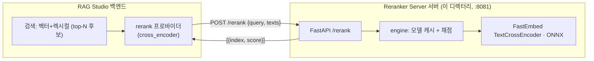
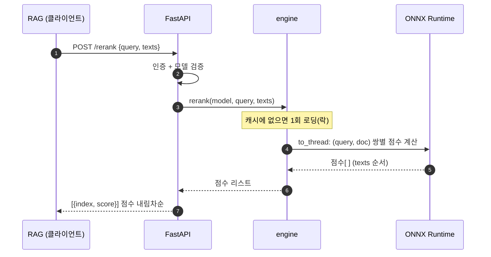

# Argus Reranker Server 서버

FastEmbed(ONNX) **cross-encoder** 기반 재정렬 서버입니다. RAG Studio 백엔드와 **완전히 독립된
배포물**로, 1차 검색으로 추린 후보(top-N)를 query 와의 관련도로 다시 정렬해 정확도를 높입니다.
RAG 의 `rerank.provider=cross_encoder` 가 이 서버를 가리킵니다(TEI `/rerank` 호환).

> 임베딩 서버(`embedding_server/`)와 **별도** 서비스입니다 — 임베딩(bi-encoder, 핫패스 고빈도)과
> 리랭킹(cross-encoder, 질의당 top-N)은 모델 종류·부하 프로파일이 달라 분리합니다.



## 엔드포인트

| 메서드 | 경로 | 설명 |
|---|---|---|
| POST | `/rerank` | `{query, texts[, model, top_n]}` → `[{index, score}, ...]` (점수 내림차순, TEI 호환) |
| GET | `/v1/models` | 제공 Reranker Server(cross-encoder) 모델 목록 |
| GET | `/health` | 헬스체크 |

## 동작 원리

cross-encoder 는 임베딩(bi-encoder)과 달리 **(query, document) 쌍을 함께** 입력받아 직접
관련도 점수를 냅니다. 더 정확하지만 비싸므로, 1차 검색이 추린 소수 후보에만 적용합니다.



## Docker 로 실행 (권장)

```bash
cd reranker_server
docker compose up -d --build
curl -s localhost:8081/health
```

## 배포 (이미지 파이프라인 · 에이전트)

배포 이미지 이름은 `argus-rag-studio-<kind>-server:<tag>[-variant]` 규약을 따른다(이 서버는 kind=`reranker`).
변형(variant)은 태그 접미사로 표현한다: CPU=접미사 없음, amd64 GPU=`-gpu`, arm64(DGX Spark/Blackwell) GPU=`-gpu-torch`.

- **이미지 빌드(로컬)**: `make image KIND=reranker [VARIANT=gpu|gpu-torch]` (리포 루트에서 실행).
- **멀티아키 빌드·푸시**: `VERSION=<v> REGISTRY=<zot>/argus make images-push`.
  - 예) `argus-rag-studio-reranker-server:latest`(CPU), `:latest-gpu`(amd64 GPU), `:latest-gpu-torch`(arm64/Blackwell GPU).
- **레지스트리**: zot(`extensions/zot-registry/`). 에어갭(폐쇄망) 반입 절차는 `extensions/zot-registry/README.md` 참고.
- **원격 배포**: RAG Studio "에이전트" 화면 → 서비스/배포에서 kind=`reranker` 선택 → 각 호스트의 Argus RAG Studio Agent(:4501)가 Docker 로 컨테이너를 기동한다.
  배포가 완료되면 해당 서버의 URL 이 RAG Studio 설정 `rerank.server_url` 에 자동 주입된다.

## 직접 실행 (Makefile)

```bash
cd reranker_server
make dev      # pip install -r requirements.txt
make run      # ARGUS_RERANKER_SERVER_CONFIG_DIR=packaging/config 로 기동
```

## 설정

임베딩 서버와 **동일한 방식** — `config.yml` + `config.properties` + `RERANK_*` 환경변수 오버라이드.

| 환경변수 | config 키 | 기본값 | 설명 |
|---|---|---|---|
| `RERANK_HOST` | `server.host` | `0.0.0.0` | 바인딩 호스트 |
| `RERANK_PORT` | `server.port` | `8081` | 포트(RAG `rerank.server_url` 과 맞춤) |
| `RERANK_LOG_DIR` | `log.dir` | `logs`(dev) | 로그 디렉터리 |
| `RERANK_API_KEY` | `rerank.api_key` | `changeme` | `Authorization: Bearer`. 빈값이면 무인증. **RAG `rerank.api_key` 와 동일해야 함** |
| `RERANK_DEFAULT_MODEL` | `rerank.default_model` | `Xenova/ms-marco-MiniLM-L-6-v2` | model 미지정 시 사용 모델 |
| `RERANK_MODELS` | `rerank.models` | (없음) | 노출 모델 화이트리스트(콤마구분) |
| `RERANK_CACHE_DIR` | `rerank.cache_dir` | (FastEmbed 기본) | 모델 캐시 경로(도커 볼륨용) |
| `RERANK_PRELOAD` | `rerank.preload` | `false` | 시작 시 기본 모델 미리 로딩 |
| `RERANK_MAX_BATCH` | `rerank.max_batch` | `256` | 단일 요청 최대 texts 수 |

### 모델 (FastEmbed cross-encoder)

| 모델 | 용량 | 비고 |
|---|---|---|
| `Xenova/ms-marco-MiniLM-L-6-v2` | 0.08GB | 영어, 가장 가벼움(기본) |
| `Xenova/ms-marco-MiniLM-L-12-v2` | 0.12GB | 영어 |
| `jinaai/jina-reranker-v1-turbo-en` | 0.15GB | 영어 |
| `BAAI/bge-reranker-base` | 1.04GB | 다국어 |
| `jinaai/jina-reranker-v2-base-multilingual` | 1.11GB | **다국어(한국어) 1순위 추천** |

### 로깅

catalog/RAG/임베딩 서버와 **동일 포맷·일단위 롤링** + 콘솔(stdout, `docker logs`).

## RAG Studio 연결

RAG 백엔드 설정:

```
rerank.provider=cross_encoder
rerank.server_url=http://<host>:8081/rerank
rerank.api_key=changeme        # Reranker Server 서버 RERANK_API_KEY 와 동일(기본값 일치)
```

또는 파이프라인/컬렉션의 Reranker Server를 `cross_encoder` 로 설정하면 이 서버가 호출됩니다.

## GPU 가속

기본은 CPU다. 처리량을 높이려면 GPU로 띄운다(리랭크는 질의 시점이라 대량 인덱싱과는 무관하지만,
질의 부하가 큰 환경에서 유용).

```bash
docker compose -f docker-compose.gpu.yml up -d --build
# 또는
docker run --rm --gpus all -p 8081:8081 -e RERANK_DEVICE=cuda argus-rag-studio-reranker-server:latest-gpu
```

- **GPU 활성**: `RERANK_DEVICE=cuda` (`requirements-gpu.txt`의 `fastembed-gpu`). 실패 시 **CPU 폴백**.
  특정 GPU만: `RERANK_CUDA_DEVICE_IDS=0`.
- **워밋업**: `RERANK_PRELOAD=true` 면 기동 시 모델 로딩 + 더미 1회 추론.
- ⚠️ `Dockerfile.gpu`의 CUDA 베이스 태그는 onnxruntime-gpu 요구 버전에 맞춰 조정.

### torch(sentence-transformers) GPU 백엔드 — aarch64 / Blackwell

`onnxruntime-gpu` 는 **aarch64 휠이 없어** DGX Spark(GB10/sm_121) 같은 ARM+Blackwell 호스트에선
위 ONNX GPU 이미지를 못 쓴다. 이때는 **torch(cu128) 백엔드**로 GPU 가속한다.

```bash
docker compose -f docker-compose.gpu-torch.yml up -d --build
```

- `RERANK_BACKEND=sentence_transformers` + `RERANK_DEVICE=cuda` — `engine_st`(CrossEncoder)가 torch 로 채점.
  CUDA 런타임은 torch cu128 휠에 포함(`Dockerfile.gpu-torch`, `python:3.11-slim` + cu128 torch).
- `RERANK_DEFAULT_MODEL` 권장: 한국어/다국어는 **`BAAI/bge-reranker-v2-m3`**(영어 경량은
  `cross-encoder/ms-marco-MiniLM-L-6-v2`). `RERANK_MODELS` 화이트리스트로 노출 모델 고정.
- 리랭크는 **질의 시점**이라 모델 교체에 재인덱싱이 필요 없다. GPU 미가용 시 자동 CPU 폴백.

## 메트릭 (원격 모니터링)

| 엔드포인트 | 형식 | 용도 |
|---|---|---|
| `GET /stats` | JSON | 시스템(CPU/RAM/디스크)·GPU·요청·모델 스냅샷 — Argus '잡 모니터링 > 외부 서버' 탭이 폴링 |
| `GET /metrics` | Prometheus 텍스트 | Prometheus/Grafana 스크레이프 |

- 시스템 메트릭은 `psutil`(requirements 포함), **GPU 메트릭은 `nvidia-ml-py`**(requirements-gpu 포함)로 수집한다.
  미설치/CPU 환경에서는 해당 항목만 생략하고 엔드포인트는 항상 200을 반환한다(graceful).
- 값은 1.5초 캐시(스크레이프 폭주 방지), 요청 카운터는 항상 최신.
